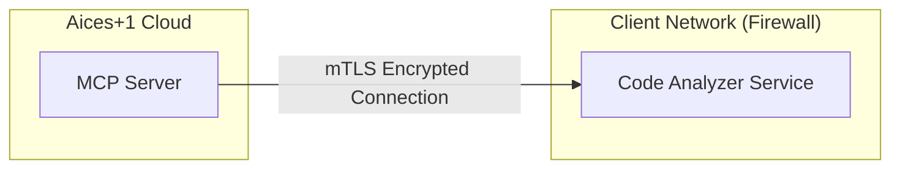

# 🚀 Deployment Guide

This guide outlines the secure deployment architecture for the Aices Plus One system, typically used in enterprise environments where the Code Analyzer sits within a private network.

## Architecture Overview

The system is designed with a split architecture to maximize security while leveraging cloud AI capabilities:

1.  **Code Analyzer Service (On-Premise / Private VPC)**:
    -   Sits securely inside the client's private network (behind firewalls).
    -   Has direct access to the source code repositories.
    -   **Does NOT** require inbound public internet access.
    -   Exposes a secure API endpoint for the MCP Server.

2.  **Aices+1 MCP Server (Cloud)**:
    -   Hosted on the Aices+1 Cloud infrastructure.
    -   Connects to the Code Analyzer to fetch architectural metadata.
    -   Uses **Gemini 2.5** to generate diagrams.

## 🔒 Security: mTLS Connection

To maintain the highest security standards, the connection between the Cloud MCP Server and the On-Premise Code Analyzer is secured using **Mutual TLS (mTLS)**.

### Traffic Flow


### Network Requirements
1.  **Firewall Configuration**:
    -   The client's firewall must allow **inbound** connections on the Analyzer's port (default: 443 or custom).
    -   Allowed source IP: **Aices+1 Cloud Static IPs** (contact support for list).
    
2.  **Authentication**:
    -   The Code Analyzer is configured to **only** permit connections from the Aices+1 MCP Server certificate.
    -   All other connection attempts are rejected at the TLS handshake level.
    -   This prevents unauthorized access even if the port is exposed.

## Deployment Steps

### 1. Code Analyzer (Client Side)
Deploy the `AicesPlusOne` Docker container in your private network.

```bash
docker run -d \
  -p 8443:8443 \
  -v /path/to/certs:/etc/certs \
  -e MTLS_ENABLED=true \
  -e CA_CERT=/etc/certs/ca.crt \
  -e SERVER_CERT=/etc/certs/server.crt \
  -e SERVER_KEY=/etc/certs/server.key \
  aices-code-analyzer:latest
```

### 2. Connect to Cloud
Provide your endpoint URL (e.g., `https://analyzer.internal.corp.com:8443`) to the Aices+1 Cloud dashboard. The cloud system will attempt an mTLS handshake to verify connectivity.
