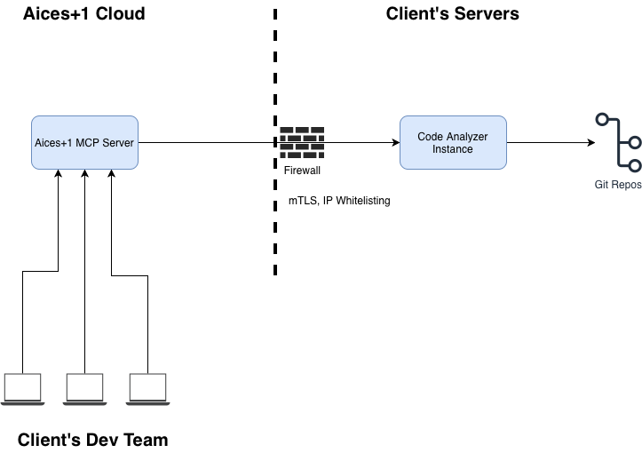

# Aices Plus One: Complete C4 Architecture Intelligence System

> An intelligent AI-powered MCP service that automatically generates and provides detailed architectural context from the entire organization's codebase, combining a comprehensive code analysis service with an AI agent.

## 🏗️ System Overview

This project consists of three main components working together to provide complete architectural intelligence:

1. **🔍 Code Analyzer Service** (`AicesPlusOne/`) - A comprehensive Git repository manager that extracts project metadata using Tree-sitter.
2. **🤖 C4 Architecture Agent** (`AicesPlusOneAgent/`) - An AI agent powered by **Gemini 2.5** that generates C4 architecture diagrams and exposes data via:
   - **Model Context Protocol (MCP)** for AI tools.
   - **REST API** for the Web UI and VS Code extension.
3. **🖥️ Visual Interfaces**
   - **Web UI**: A split-pane dashboard to view and edit C4 diagrams.
   - **VS Code Extension**: A sidebar that shows architectural context for your active file.



## 🎯 What It Does

### C4 Architecture Agent
This agent analyzes your code repositories and automatically generates comprehensive C4 architecture diagrams at three levels:
1. **Context View** - Shows your system in its environment with users and external systems.
2. **Container View** - Details the applications, services, and data stores.
3. **Component View** - Breaks down the internal structure of containers.

All diagrams are generated in structured JSON format with PlantUML scripts for visualization.

### Storage & Persistence
The system now supports decoupled storage backends:
- **Local Storage** (Default): Stores architecture in `AicesPlusOneAgent/data/memory.json`.
- **Google Cloud Storage (GCS)**: Stores architecture in a GCS Bucket. Set `STORAGE_TYPE=gcs` and `GCS_BUCKET_NAME=my-bucket`.

## 🚀 Quick Start (Local Development)

### 1. Start the Code Analyzer Service
The analyzer runs in the background to keep code metadata fresh.

```bash
# Navigate to the analyzer service
cd AicesPlusOne

# Quick setup and start
python setup.py
python dev_server.py
```
The service will be available at `http://localhost:8000` with API docs at `/docs`.

### 2. Start the Agent & Web UI
The Agent now includes a `start_ui.sh` script to launch both the API backend and the React UI.

```bash
# Navigate to the agent
cd AicesPlusOneAgent

# Install dependencies (First time only)
pip install -r requirements.txt
cd ui && npm install && cd ..

# Configure
echo "GOOGLE_API_KEY=your-gemini-api-key" > .env
echo "CODE_ANALYSIS_API_URL=http://localhost:8000" >> .env

# Start API + UI
./start_ui.sh
```

- **Web UI**: Open `http://localhost:5173` to view diagrams and regenerate architecture.
- **Agent API**: Running at `http://localhost:8001`.

### 3. Running the VS Code Extension
See architectural context directly in your editor.

1. Navigate to `AicesPlusOneVSCode`.
2. Install dependencies: `npm install`.
3. Open the folder in VS Code.
4. Press **F5** to verify the extension in the Extension Development Host.
5. Open any source file in the host window to see its "Component" or "Container" context in the Architecture sidebar.
   *(Note: The Agent API must be running for this to work).*

##  Supported Languages & Capabilities

| Language   | Entry Points | Dependencies | Project Type Detection | Frameworks Detected |
|------------|--------------|--------------|----------------------|-------------------|
| Python     | ✅ Functions, Classes | ✅ requirements.txt, setup.py | ✅ | FastAPI, Flask, Django |
| JavaScript | ✅ Functions, Classes | ✅ package.json | ✅ | Express, React, Vue |
| TypeScript | ✅ Functions, Classes | ✅ package.json | ✅ | Angular, Next.js |
| Java       | ✅ Methods, Classes | ✅ pom.xml, build.gradle | ✅ | Spring Boot, Maven |
| C++        | ⏳ Coming Soon | ⏳ CMakeLists.txt | ✅ | |
| Go         | ⏳ Coming Soon | ✅ go.mod | ✅ | Gin, Echo |
| Rust       | ⏳ Coming Soon | ✅ Cargo.toml | ✅ | Actix, Rocket |
| C#         | ⏳ Coming Soon | ✅ .csproj | ✅ | ASP.NET Core |

## 🛠️ MCP Tools

### 1. `get_stored_c4_architecture`
Get the latest C4 architecture diagram from storage in JSON format. This is a fast, read-only operation.

### 2. `generate_new_c4_architecture`
Force a fresh code analysis and AI generation of the C4 architecture. This is an expensive operation.

### 3. `update_c4_architecture_with_plantuml`
Update the stored C4 architecture by parsing a modified PlantUML script.

## 🔌 Integration Examples

### Claude Desktop Integration
Add to `~/Library/Application Support/Claude/claude_desktop_config.json`:

```json
{
  "mcpServers": {
    "c4-architecture": {
      "command": "python3",
      "args": ["/path/to/AicesPlusOneAgent/src/server.py"],
      "env": {
        "GOOGLE_API_KEY": "your-api-key-here"
      }
    }
  }
}
```

## 🎪 The Vision
Modern software is a **choreographed symphony of services**. AI coding agents are flying blind without architectural context.
**Aices Plus One** provides that context, enabling AI to write production-ready code that fits your system design.

## 📄 License
MIT License - See LICENSE file for details.

## 🙏 Acknowledgments
- Built with [Google's Generative AI](https://ai.google.dev/)
- Uses [Model Context Protocol](https://modelcontextprotocol.io/)
- Implements [C4 Model](https://c4model.com/) architecture patterns
- Powered by [Tree-sitter](https://tree-sitter.github.io/tree-sitter/) for code analysis
- UI powered by **React** & **Vite**
